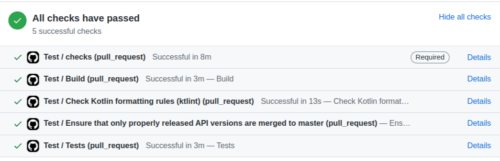

# Check run action


#### Description
Wraps execution of command-line programs with check. For e.g. we have  ktlint, build, api check and test checks for PR.
You could do it in one job - in that case you will see only one check run on PR page and you will get fail fast option.
Or you could do it with separate jobs, but it will require additional runners and do some duplicate steps like checkout
for each job that may take time. Especially it's a point when for e.g.  ktlint takes 10 sec but to prepare for it takes
2 minutes.
This action will combine two approaches  and create checks runs from step:


#### Usage:
###### Configuration:
```yaml
      - name: add check
        uses: ogotalski/check-run-action@main
        with:
          run: |
            chmod +x gradlew
            ls
            ./gradlew test jacocoTestReport
          name: Test
```


###### Example workflow:
```yaml
name: Measure coverage

on:
  pull_request:
jobs:
  build:
    runs-on: ubuntu-latest
    steps:
      - uses: actions/checkout@v2
      - name: Set up JDK 1.8
        uses: actions/setup-java@v1
        id: setup
        with:
          java-version: 1.8
      - name: Dump steps context
        run: echo '${{ toJSON(steps) }}'
      - name: add check
        id: test
        uses: ogotalski/check-run-action@main
        with:
          run: |
            chmod +x gradlew
            ls
            ./gradlew test jacocoTestReport
          name: Test
      - name: Test coverage report
        if: ${{steps.test.output.conclusion == 'success'}}
        uses: ogotalski/test-coverage-report@main
        with:
          paths: ${{ github.workspace }}/build/reports/jacoco/test/jacocoTestReport.xml,${{ github.workspace }}/MathUtils/build/reports/jacoco/test/jacocoTestReport.xml
          sourcePaths: ${{ github.workspace }}/src/main/kotlin,${{ github.workspace }}/MathUtils/src/main/java
          masterPaths: ${{ github.workspace }}/code-coverage-report/build/reports/jacoco/test/jacocoTestReport.xml,${{ github.workspace }}/code-coverage-report/MathUtils/build/reports/jacoco/test/jacocoTestReport.xml
          updateComment: true
          debug: true
          artifactWorkflow: main.yml
          artifactName: code-coverage-report
          downloadPath: code-coverage-report
```
